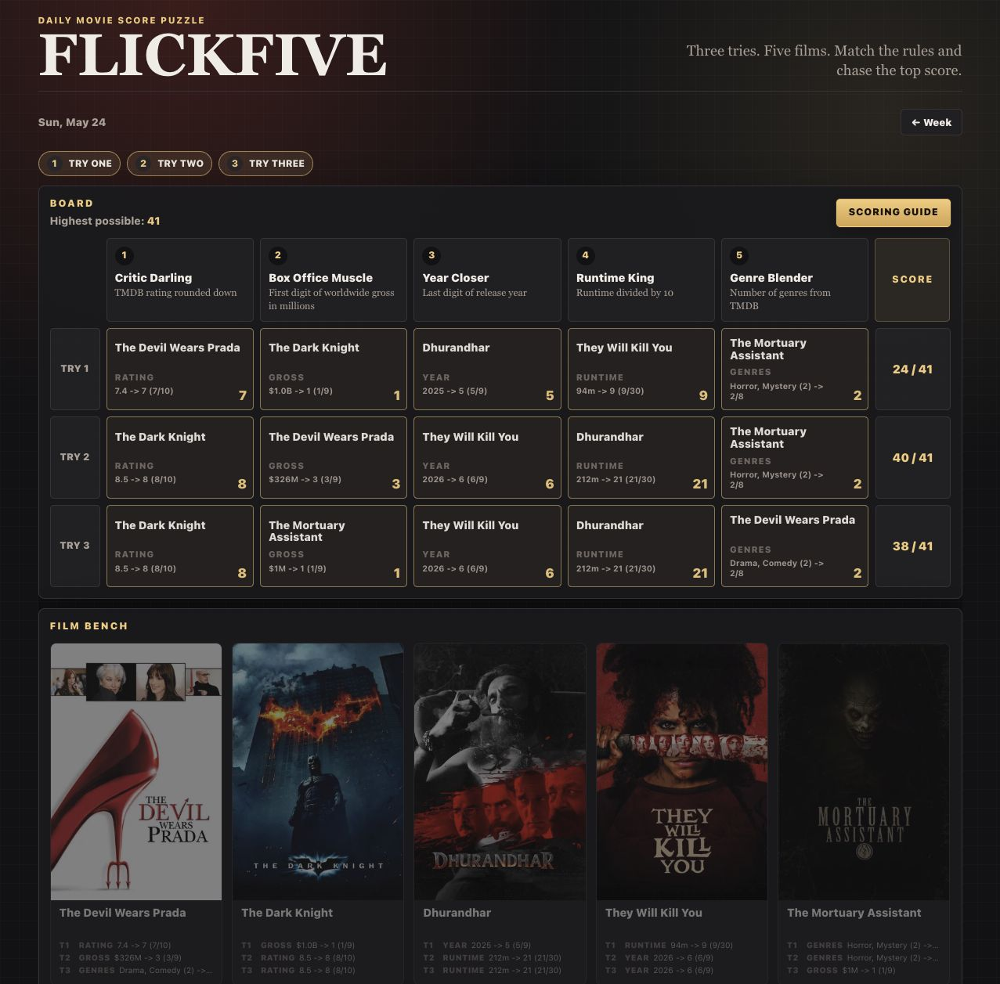

# FlickFive

Pick 5 movies, match 5 scoring rules, and maximize your total in up to 3 tries.

Live site: [https://flickfive.normware.org](https://flickfive.normware.org)



## Quick Start

### 1) Install dependencies

```bash
npm ci
```

### 2) Build static puzzle data

```bash
npm run build
```

### 3) Run locally

```bash
npm start
```

Open: [http://localhost:3000](http://localhost:3000)

## Scripts

- `npm start`: run local Express server (`public` + API routes used for local tooling)
- `npm run generate`: generate weekly puzzle source data from TMDB (`data/archive.enc`)
- `npm run export`: export static puzzle JSON to `public/data`
- `npm run build`: alias for export

## Deployment

- Public URL: [https://flickfive.normware.org](https://flickfive.normware.org)
- GitHub Pages deploy workflow: `.github/workflows/pages.yml`
- Weekly puzzle generation workflow: `.github/workflows/generate.yml`

## Legal

- Datenschutz: [https://normware.org/datenschutz](https://normware.org/datenschutz)
- Impressum: [https://normware.org/impressum](https://normware.org/impressum)

## Attribution

This product uses TMDB and the TMDB APIs but is not endorsed, certified, or otherwise approved by TMDB.
